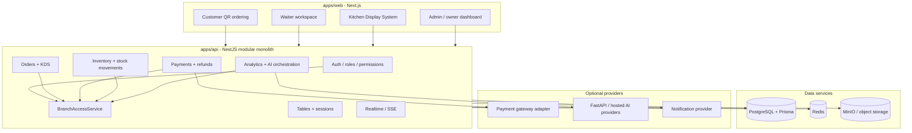

# System Architecture

The implementation is a modular monolith plus optional side services. The system is designed to be a multi-tenant Smart Restaurant Operating System.

- The browser loads a Next.js route from `apps/web`.
- Client components call the NestJS API through `apps/web/src/lib/api.ts`.
- NestJS controllers accept requests, guards authenticate/authorize, DTOs validate input, and services execute domain logic.
- Services use Prisma for all database reads/writes.
- Domain events are published to `RealtimeService` for SSE clients.
- External calls go through adapters or service boundaries: payment gateways, SMS provider, optional AI service.
- Production Docker Compose runs `web`, `api`, `ai`, PostgreSQL, Redis, MinIO, and Nginx.

## Architecture Diagram



## Repository Structure

```text
.
├── apps/
│   ├── api/                 NestJS backend API
│   ├── web/                 Next.js frontend
│   └── ai-services/         Optional FastAPI AI/ML boundary
├── packages/
│   └── shared-types/        Shared TypeScript contracts
├── docs/                    Architecture, operations, security, AI, deployment, graduation docs
├── e2e/                     Playwright end-to-end tests
├── scripts/                 Smoke, audit, bootstrap, deployment, backup/restore helpers
├── nginx/                   Production reverse-proxy config and TLS mount location
├── monitoring/              Prometheus/Loki/Grafana-related monitoring config
├── certbot/                 ACME webroot state for Let's Encrypt scripts
├── designs html/            Design/reference assets; not part of the runtime app
├── docker-compose.yml       Local infrastructure and optional AI service
├── docker-compose.prod.yml  Production app stack
├── docker-compose.monitoring.yml Monitoring/logging overlay
├── package.json             npm workspace scripts
├── package-lock.json        npm lockfile
├── tsconfig.base.json       Shared TypeScript compiler base config
├── playwright.config.ts     Playwright test config
└── README.md                Main setup and operations guide
```
