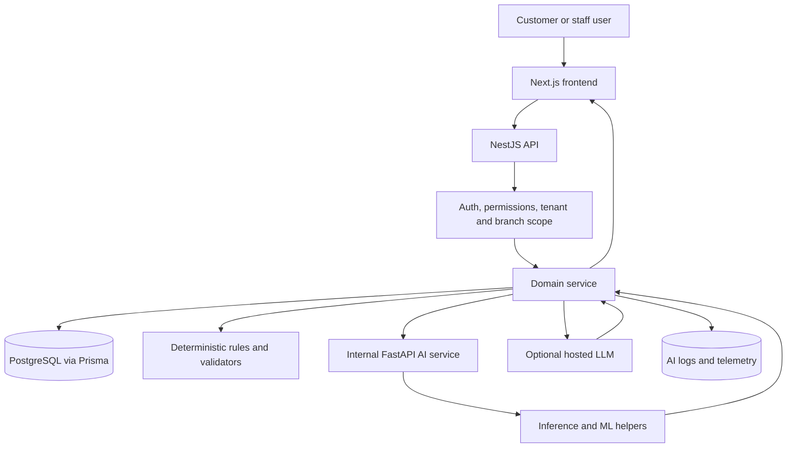

# AI Services Architecture

This document describes the AI-related runtime currently implemented in this repository.

## Overview

The project uses a backend-controlled AI boundary. Frontend clients never call model providers or the FastAPI service directly.

- `apps/web` renders AI-assisted UI surfaces.
- `apps/api` is the source of truth for tenant scope, branch scope, permissions, data loading, validation, fallbacks, and logging.
- `apps/ai-services` is the internal FastAPI inference boundary for lightweight ML and model-assisted features.
- Optional hosted LLM usage is routed from backend code only, currently through Hugging Face's OpenAI-compatible chat-completions API.

AI outputs are assistive only. They do not directly set canonical prices, permissions, availability, revenue, or other business-critical source-of-truth fields.

## User-Facing AI Features

Current AI or AI-adjacent features:

- Customer menu chat assistant
- Customer menu recommendations
- Admin demand forecasting
- Admin business insights
- Admin review sentiment analysis
- SaaS AI diagnostics and branch control surfaces

The full feature-level inventory is documented in [30_ai_feature_inventory.md](/C:/Users/support/Desktop/WS/GP/docs/5_features/20_ai_engine/30_ai_feature_inventory.md).

## Ownership Model

NestJS owns:

- auth, RBAC, CSRF, tenant and branch checks
- canonical database reads
- prompt and inference input shaping
- output validation against strict shared contracts
- deterministic fallback logic
- audit and telemetry persistence

FastAPI owns:

- internal inference endpoints
- lightweight ML scoring and ranking
- optional LLM summarization helpers
- model version metadata returned to NestJS

## Inference Endpoints

FastAPI currently exposes these internal AI endpoints:

- `POST /menu-chat`
- `POST /forecast/demand`
- `POST /business-insights/summarize`
- `POST /review-sentiment/summarize`
- `POST /recommendations/menu/infer`
- `POST /business-insights/infer`
- `POST /review-sentiment/infer`

The three `*/infer` endpoints are internal only and are meant to be called by NestJS services, not browsers.

## Engine Modes

Branch AI config now supports per-feature engine modes for:

- recommendations
- business insights
- review sentiment

Supported modes:

- `rules`: deterministic backend-only behavior
- `shadow`: return deterministic output to the UI but also compute ML output and log comparison metadata
- `ml`: use ML-ranked output when the AI response validates and meets the confidence threshold

Each feature also has:

- `confidenceThreshold`
- `timeoutMs`
- `fallbackEnabled`
- `modelFamily`
- optional `modelVersionPin`

Normalization and serialization live in [ai-engine-controls.ts](/C:/Users/support/Desktop/WS/GP/apps/api/src/modules/ai/ai-engine-controls.ts).

## Feature Wiring

### Menu Chat

- Frontend: [MenuChatAssistant.tsx](/C:/Users/support/Desktop/WS/GP/apps/web/src/components/ai/MenuChatAssistant.tsx)
- NestJS API: `POST /api/ai/menu-chat`
- NestJS service: [menu-chatbot.service.ts](/C:/Users/support/Desktop/WS/GP/apps/api/src/modules/ai/menu-chatbot.service.ts)
- Optional FastAPI helper: `POST /menu-chat`
- Optional hosted LLM helper: [menu-chat-llm.service.ts](/C:/Users/support/Desktop/WS/GP/apps/api/src/modules/ai/menu-chat-llm.service.ts)

### Recommendations

- Frontend: [RecommendedForYou.tsx](/C:/Users/support/Desktop/WS/GP/apps/web/src/components/recommendations/RecommendedForYou.tsx)
- Canonical API: `POST /api/recommendations/menu`
- Telemetry API: `POST /api/recommendations/telemetry`
- Compatibility endpoints still exist under `/api/ai/recommendations*`
- NestJS service: [recommendation.service.ts](/C:/Users/support/Desktop/WS/GP/apps/api/src/modules/ai/recommendation.service.ts)
- FastAPI inference: `POST /recommendations/menu/infer`

### Demand Forecasting

- Frontend: [DemandForecastPanel.tsx](/C:/Users/support/Desktop/WS/GP/apps/web/src/components/admin/ai/DemandForecastPanel.tsx)
- API: `GET /api/admin/ai/demand-forecast`
- NestJS service: [demand-forecast.service.ts](/C:/Users/support/Desktop/WS/GP/apps/api/src/modules/demand-forecasting/demand-forecast.service.ts)
- FastAPI inference: `POST /forecast/demand`
- Optional hosted summary helper: [demand-forecast-llm.service.ts](/C:/Users/support/Desktop/WS/GP/apps/api/src/modules/demand-forecasting/demand-forecast-llm.service.ts)

### Business Insights

- Frontend: [business-insights-panel.tsx](/C:/Users/support/Desktop/WS/GP/apps/web/src/components/admin/ai/business-insights-panel.tsx)
- API: `GET /api/admin/ai/business-insights`
- NestJS service: [business-insights.service.ts](/C:/Users/support/Desktop/WS/GP/apps/api/src/modules/business-insights/business-insights.service.ts)
- FastAPI inference: `POST /business-insights/infer`
- Optional hosted summary helper: `POST /business-insights/summarize`

### Review Sentiment

- Frontend: [ReviewSentimentPanel.tsx](/C:/Users/support/Desktop/WS/GP/apps/web/src/components/admin/ai/ReviewSentimentPanel.tsx)
- API: `GET /api/admin/ai/review-sentiment`
- NestJS service: [review-sentiment.service.ts](/C:/Users/support/Desktop/WS/GP/apps/api/src/modules/reviews/review-sentiment.service.ts)
- FastAPI inference: `POST /review-sentiment/infer`
- Optional hosted summary helper: `POST /review-sentiment/summarize`

## Safety Rules

The current implementation enforces these boundaries:

- frontend never calls FastAPI directly
- backend validates all model responses before returning them
- tenant and branch scoping remain in NestJS
- AI failures fall back to deterministic behavior or reduced capability
- AI logs and summaries are audit-friendly and scoped

## Logging And Telemetry

Relevant persistence models include:

- `RecommendationLog`
- `RecommendationInteraction`
- `MenuChatLog`
- `DemandForecastLog`
- `DemandForecastAccuracy`
- `BusinessInsightLog`
- `ReviewSentimentLog`

These logs are used for diagnostics, auditability, and future evaluation of model-backed behavior.

## SaaS Controls

The SaaS owner surface at `/saas/controls?tab=ai` currently exposes branch-level menu-chat controls and diagnostics. The backend also supports per-feature engine settings for recommendations, business insights, and review sentiment through branch AI config and SaaS admin DTOs, even though the current UI is still centered on menu-chat-focused controls.

## Architecture Diagram

