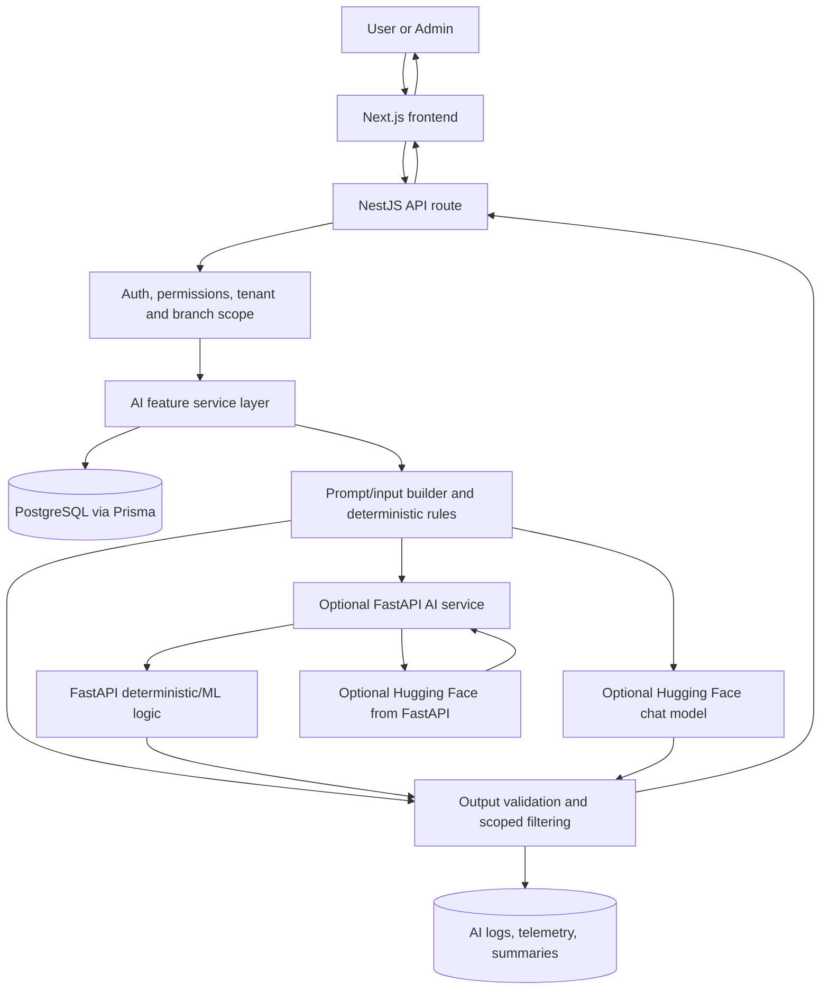

# AI Services Architecture

This document describes the AI-related services currently present in this repository. It is based on the codebase structure, NestJS API modules, FastAPI service, frontend components, shared contracts, Prisma schema, environment configuration, tests, and existing AI docs.

## AI System Overview

The project uses assistive AI and AI-adjacent analytics. The AI features are not the source of truth for restaurant data. Core numbers, permissions, tenant scope, branch scope, item availability, prices, revenue, order counts, review aggregates, and audit records are computed or validated in the NestJS backend before any hosted model or FastAPI service can affect the response.

AI appears in the user experience in these places:

- Customer menu assistant: `apps/web/src/components/ai/MenuChatAssistant.tsx` lets customers ask branch-menu questions and get grounded suggestions.
- Customer recommendations: `apps/web/src/components/recommendations/RecommendedForYou.tsx` shows rule-based menu recommendations on menu and cart pages.
- Admin business insights: `apps/web/src/components/admin/ai/business-insights-panel.tsx` shows deterministic operational alerts and an optional AI-polished summary.
- Admin demand forecast: `apps/web/src/components/admin/ai/DemandForecastPanel.tsx` shows forecasted orders, revenue, items, ingredients, data-quality warnings, and an optional LLM narrative.
- Admin review sentiment: `apps/web/src/components/admin/ai/ReviewSentimentPanel.tsx` shows deterministic review sentiment, alerts, item timelines, operational correlations, and suggested actions.

AI logic exists on both frontend and backend, but provider calls are backend-only:

- Frontend components only call NestJS API routes.
- NestJS owns tenant/branch validation, database reads, prompt/input shaping, output validation, fallbacks, and audit logging.
- `apps/ai-services` is an optional internal FastAPI boundary for lightweight ML/model-assisted tasks.
- Hosted LLM calls use Hugging Face's OpenAI-compatible chat completion endpoint from backend code only.

## AI Architecture Diagram

