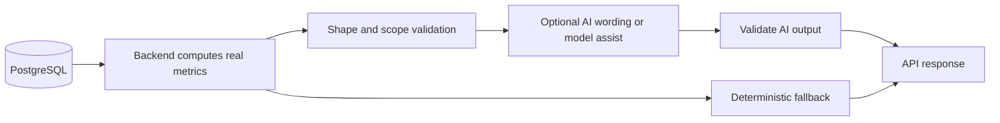

# AI Features

AI features in Smart Restaurant OS are assistive. They explain, summarize, recommend, or forecast from scoped business data. They must not invent core business totals.

## Implemented AI Areas

| Feature | Surface | Primary Source Of Truth |
|---|---|---|
| Menu recommendations | Customer ordering and recommendation APIs | Branch menu, order/session history, scoped menu availability |
| Menu chat assistant | Customer menu UI and backend AI module | Branch menu catalog and deterministic local fallback logic |
| Business insights | Admin dashboard/analytics | Prisma-computed metrics for inventory, kitchen, sales, refunds, reviews |
| Demand forecasting | Admin AI forecast panel | Historical scoped orders, item sales, menu prices, inventory mappings |
| Review sentiment | Admin analytics | Stored reviews and linked operational context |

## Data Flow Principle

AI is not the source of truth for restaurant metrics.



The backend computes real metrics first:

- sales totals
- order counts
- menu item sales
- low-stock counts
- prep-time samples
- branch/session/order context
- review counts and ratings
- forecast inputs and sample quality

AI can add wording, ranking, explanation, or an ML-assisted forecast only after those inputs exist.

## Output Validation

AI JSON or structured output is validated before use.

Implemented validators include:

- business insight summary payload validation
- demand forecast LLM summary validation
- demand forecast ML item prediction validation

Invalid output is discarded and the response falls back to deterministic computed analytics.

## Fallback Behavior

If an AI provider fails, times out, returns malformed JSON, or returns unusable content:

- the dashboard should not crash
- computed analytics are still returned
- response may include `aiFallbackMessage`
- backend logs enough context for debugging

Standard fallback message:

```text
AI summary is temporarily unavailable, but analytics were generated successfully.
```

## Demand Forecast Fields

Demand forecast responses include explainability fields such as:

- `expectedOrders`
- `expectedRevenue`
- `items[].expectedQuantity`
- `items[].expectedRevenue`
- `items[].confidence`
- `items[].reason`
- `items[].confidenceReason`
- `dataQualityWarnings`
- `summaryText`
- optional `llmSummary`
- optional `aiFallbackMessage`

Confidence should be read as a signal about historical sample quality, not a guarantee.

## Branch And Tenant Safety

AI analytics routes must respect the same tenant/branch rules as other operational modules:

- tenant-wide views require a role allowed to omit branch scope
- branch views require access to the selected branch
- public menu AI features must use the session or branch context supplied by trusted backend records
- AI services should not be called directly from frontend clients

## Limitations

- The FastAPI AI service is optional in local development.
- Hosted LLM/provider integration is configurable and may be unavailable.
- Forecasting is explainable but not a demand guarantee.
- AI outputs are intentionally conservative; deterministic data remains the source of truth.
- Provider-specific monitoring and cost controls should be expanded before production AI usage.

## Related Docs

- [Business Insights Assistant](ai/business-insights-assistant.md)
- [Demand Forecasting Engine](ai/demand-forecasting-engine.md)
- [Menu Chatbot Assistant](ai/menu-chatbot-assistant.md)
- [Menu Recommendation Engine](ai/menu-recommendation-engine.md)
- [Review Sentiment Analyzer](ai/review-sentiment-analyzer.md)
