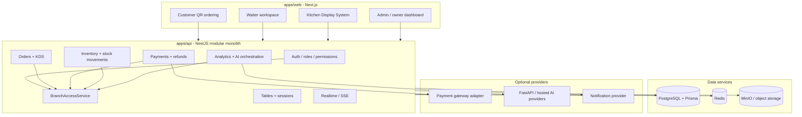
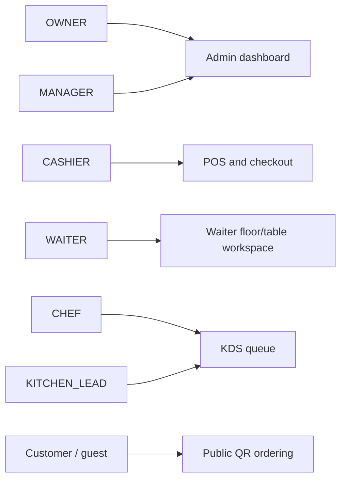
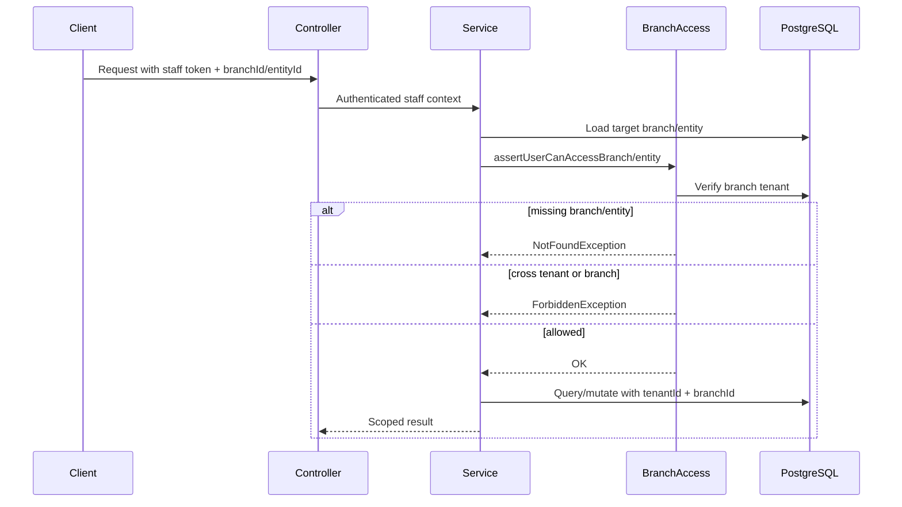
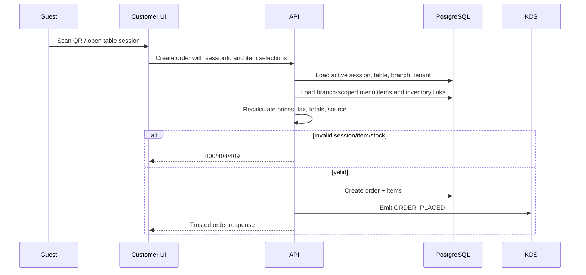
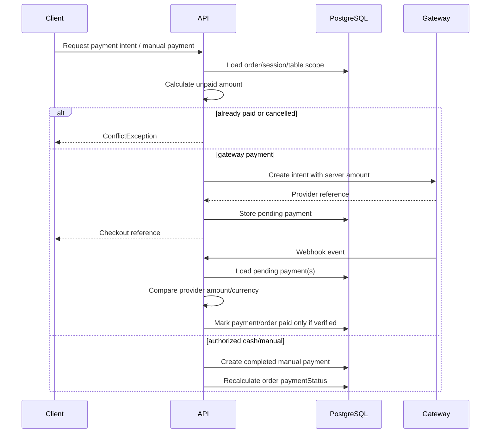
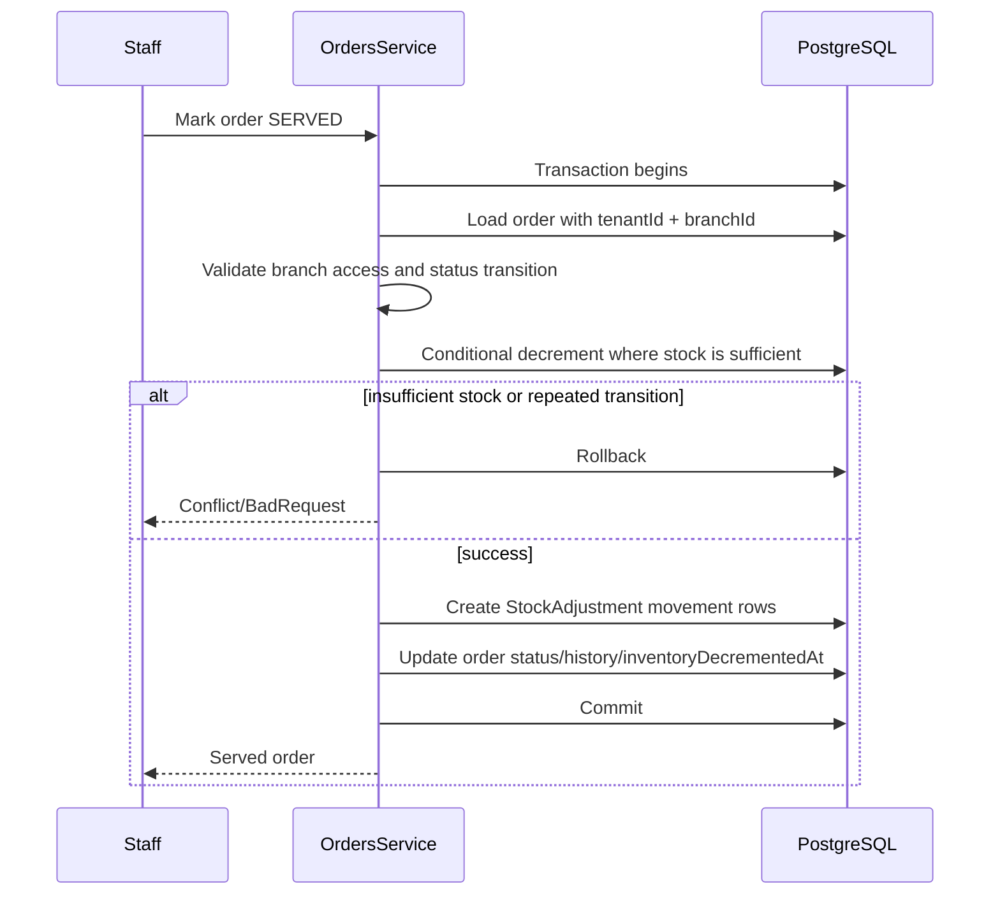
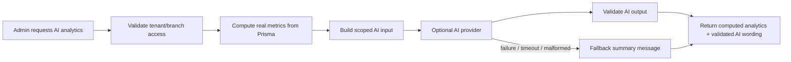

# Architecture Notes

This scaffold follows the direction stated in the extracted documentation:

- Next.js for a unified frontend surface
- NestJS for the backend REST API
- PostgreSQL for the primary relational datastore
- Redis for cache, session, and initial event support
- MinIO-compatible object storage for logs, reports, and AI artifacts
- Python AI microservices for assistive intelligence features

## Early Architectural Assumptions

1. The MVP uses one web codebase with role-based areas instead of four disconnected frontend repos.
2. The backend should start as a modular monolith with clear bounded contexts and a single logical database.
3. Tenant and branch scoping are first-class concerns and should be represented in API contracts and persistence from the start.
4. Infrastructure services run in Docker; application services run locally during active development.
5. AI remains an internal capability behind backend-controlled access paths for auditability and tenant isolation.
6. External integrations are adapter-driven: payments, notifications, storage, and AI providers should not leak directly into business modules.

## Suggested Backend Module Roadmap

- `auth`
- `tenancy`
- `roles`
- `branches`
- `tables`
- `sessions`
- `menu`
- `orders`
- `kds`
- `payments`
- `pos`
- `shifts`
- `service-requests`
- `reporting`
- `analytics`
- `realtime`
- `audit`
- `notifications`
- `inventory`
- `loyalty`
- `integrations`

## Diagram Alignment

The supplied diagrams add these concrete environment decisions:

- frontend surfaces:
  `customer`, `staff`, and `admin` are distinct user-facing areas, even if they live in one Next.js app initially
- backend services:
  `api-gateway`, `authentication`, `menu-pricing`, `orders`, `payments`, `analytics`, and `realtime`
- integrations:
  payment gateways, notification services, object storage, and AI modules
- realtime model:
  websocket delivery on top of an internal event layer

For the current scaffold, Redis is the pragmatic first event layer. If you later need stronger delivery guarantees or consumer groups, replace that slice with a dedicated broker.

## Updated Architectural Interpretation

The new requirements tighten the design in these ways:

- one logical normalized schema is the source of truth for reporting and synchronization
- all frontends use backend APIs only and never access the database directly
- dining is session-based, not just order-based
- waiter and kitchen operations are first-class domains, not side-features of admin POS
- optional modules such as inventory, loyalty, marketplace, and online ordering must remain feature-flagged
- phase one should optimize for correctness and auditability before decomposition into more services

## Current System Architecture

## Role And Surface Map

Frontend route restrictions improve UX, but backend guards and services enforce access.

## Branch Authorization Flow

## Public QR Order Lifecycle

## Payment Lifecycle

## Inventory Served Transition Lifecycle

## AI Analytics Lifecycle

